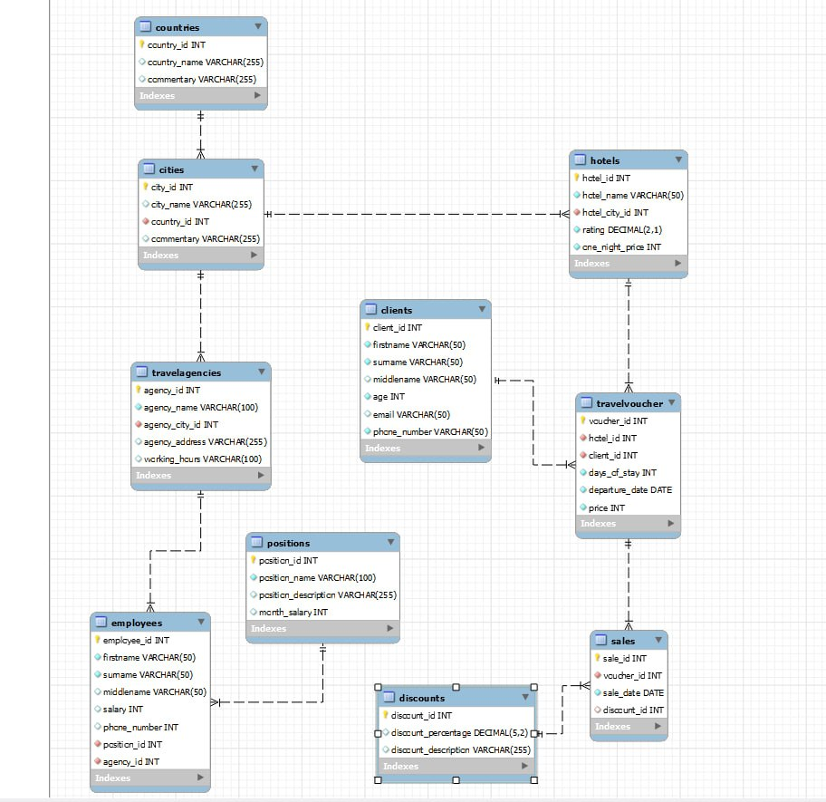
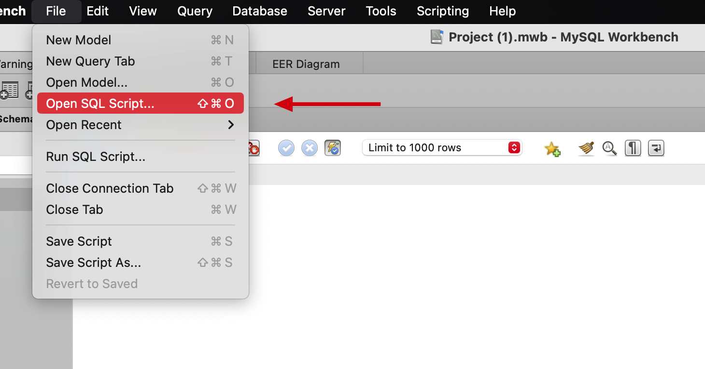
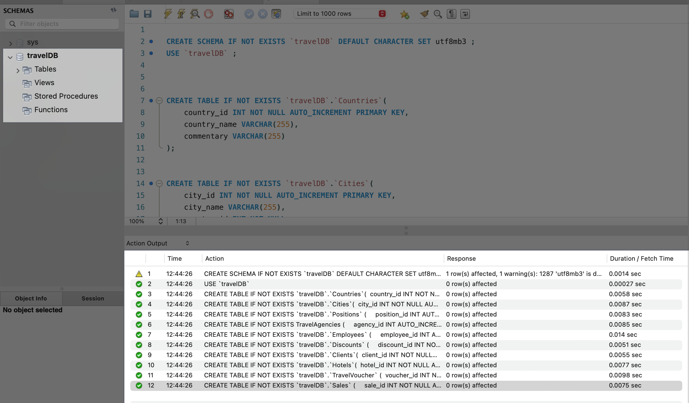
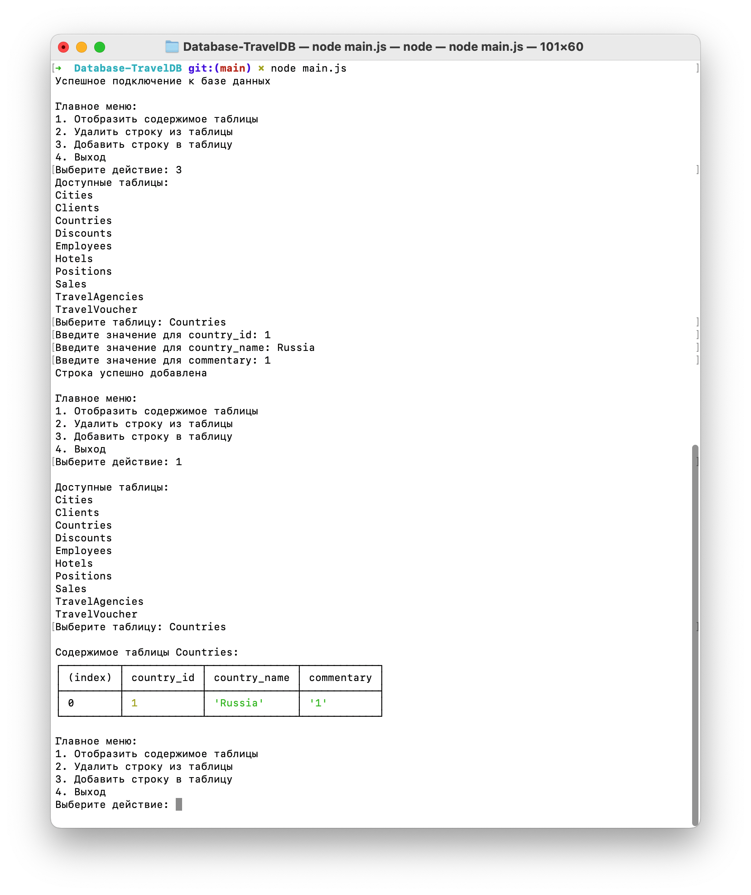

# Проектирование бызы данных
## База данных для турагенства

### EER-диаграмма базы данных

### Запуск проекта в MySQL Workbench

- Создать соединение с сервером в MySQL Workbench;
- Открыть sql скрипт `script.sql`;

- Запускаем скрипт;

**Success! База данных успешно загружена! 🥳**

### Дополнительно

> С помощью файла `main.js` можно проверить содержимое таблицы, также добавить или удалить строку в таблице.

> Используя файл `project.mvb`, можно отркыть ERR-диаграмму и сгенерировать sql скрипт для инициализации базы данных.

**Для запуска скрипта**

1. `npm install`
2. `npm run start`

> Проект создали: Нахатакян Артур, Киняев Илья и Магер Егор.
